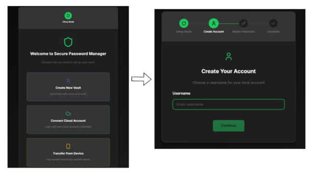
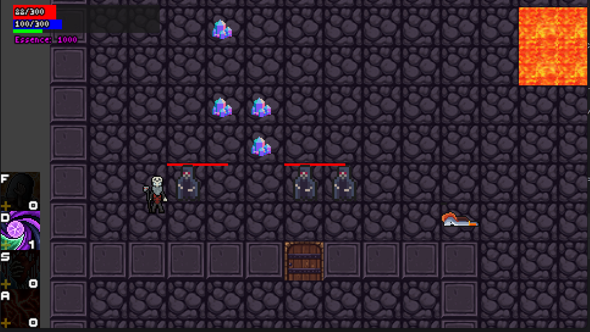
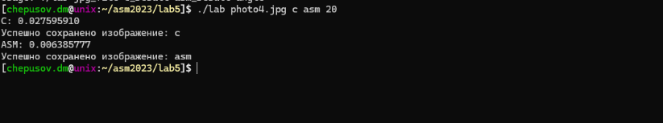

# 👨‍💻 Техническое Резюме

## 🚀 О себе

**Fullstack разработчик с глубоким пониманием системного программирования и современного веб-разработки**

### 🎯 **Путь развития и технический рост**

Мой путь в программировании начался с **системного программирования на C** в университете, где я прошел курс по **Алгоритмам и структурам данных**. Этот опыт научил меня **управлению памятью на низком уровне** - каждый байт был под контролем, что заложило фундамент для понимания эффективности и производительности программ.

**C++20 и многопоточность:** Следующим этапом стало освоение **C++20**, на котором я реализовал **полнофункциональную 2D игру** с использованием **SFML** и **MVC архитектуры**. Это проект познакомил меня с **многопоточным программированием** и его вызовами - **гонками данных**, **deadlock'ами** и **race condition'ами**. Для отладки использовал **санитайзеры (AddressSanitizer, ThreadSanitizer)**, что позволило глубоко понять принципы безопасного многопоточного кода.

**Java и Enterprise разработка:** Параллельно изучал **Java**, где получил практический опыт в **Spring Boot**, **Java Core** (компания 1С).

**Python и Fullstack разработка:** Для реализации коммерческих проектов выбрал **Python** как инструмент быстрой разработки. Здесь я освоил:
- **Транзакции и ACID принципы** в базах данных
- **Блокировки таблиц** и **оптимистичные блокировки** для предотвращения конфликтов
- **Системы кэширования** с **Redis** и стратегии **валидации кэша**
- **DevOps практики** - деплой на серверы, настройка **Nginx**, **SSL сертификатов**
- **Безопасность серверов** - защита от **SSH брутфорс атак**, настройка **fail2ban**, **firewall'ов**
- **Брокеры сообщений** (**Redis**, **RabbitMQ**) для **асинхронной обработки**
- **Контейнеризация** с **Docker** и **Docker Compose**

### 🌐 **Frontend разработка**

Хотя основная специализация - backend, я также освоил **frontend разработку**:
- **React.js** с **TypeScript** для создания современных SPA
- **Компонентная архитектура** и принципы **разделения ответственности**
- **CSS-in-JS** и **дефолтные стили** для консистентного UI
- **Web Storage API** - **localStorage**, **sessionStorage**, **cookies**
- **State management** и **клиентская валидация**

### 🧠 **Алгоритмическое мышление**

Регулярно решаю задачи на **LeetCode** - **более 100 решенных задач** различной сложности. Это помогает поддерживать **алгоритмическое мышление** и понимание **временной и пространственной сложности** алгоритмов.

### 🎯 **Философия разработки**

Верю в **прагматичный подход** - выбор технологий на основе **конкретных требований проекта**, а не моды. **C/C++** для системных задач, **Python** для быстрого прототипирования и веб-разработки, **Java** для enterprise решений. Постоянно изучаю новые технологии, но всегда возвращаюсь к **фундаментальным принципам** - **чистому коду**, **тестированию**, **безопасности** и **производительности**.

---

## 🛠 Технические проекты

### 🔐 Agregator (NDA проект)
**Fullstack микросервисное приложение с полной системой аутентификации**

**Основные технологии:**
- **Frontend:** React.js, TypeScript, современный UI/UX
- **Backend:** FastAPI, Python, Tortoise ORM
- **Аутентификация:** Полная реализация сессионной системы с 2FA, админ-панелью
- **База данных:** PostgreSQL с миграциями через Aerich, MongoDB для NoSQL данных
- **Кэширование:** Redis для сессий, кэша и очередей
- **Асинхронность:** Celery для фоновых задач, Celery Beat для планировщика
- **Контейнеризация:** Docker, Docker Compose
- **Мониторинг:** Grafana, Prometheus, Loki, Promtail
- **Дополнительно:** Telegram боты, webhook система, REST API

**Архитектурные особенности:**
- **Модульная структура** с разделением на провайдеров
- **Middleware для обработки запросов** и валидации
- **Система уведомлений и webhook'ов** с очередями Redis
- **Административная панель** с кастомизацией и управлением пользователями
- **Frontend-Backend взаимодействие** через REST API
- **Интеграционная архитектура** - возможность подключения любых внешних процессингов
- **Гибкая система 2FA** с поддержкой Google Authenticator и настраиваемыми методами

---

### 🏭 Proccessing (NDA проект)
**Fullstack микросервисная платформа с JWT аутентификацией**

**Основные технологии:**
- **Frontend:** React.js, TypeScript, современный UI/UX
- **Backend:** Django, FastAPI, Python
- **Аутентификация:** JWT токены с полной системой авторизации
- **База данных:** PostgreSQL, Django ORM, MongoDB для NoSQL данных
- **Кэширование:** Redis для сессий, кэша и очередей
- **Асинхронность:** Celery, Celery Beat, Flower для мониторинга
- **Контейнеризация:** Docker, Docker Compose
- **Серверная инфраструктура:** Nginx, fail2ban, SSL сертификаты
- **Мониторинг:** Grafana, Prometheus, Loki, Promtail
- **Дополнительно:** Telegram боты, MinIO для файлового хранилища

**Архитектурные особенности:**
- Микросервисная архитектура с брокерами сообщений
- Система логирования и мониторинга
- Автоматизированные скрипты развертывания
- Frontend-Backend взаимодействие через REST API

---

### 📱 Android App (NDA проект)
**Мобильное приложение с современным стеком технологий**

**Основные технологии:**
- **Язык:** Kotlin
- **Архитектура:** MVVM, Clean Architecture
- **Сборка:** Gradle, Kotlin DSL
- **UI:** Material Design компоненты
- **Дополнительно:** Git для версионирования

**Особенности разработки:**
- Современные принципы Android разработки
- Использование актуальных инструментов сборки
- Следование Material Design гайдлайнам

---

### 🎓 Университетский проект: Secure Password Manager
**Полнофункциональное десктопное приложение для управления паролями с гибридной архитектурой**

**Основные технологии:**
- **Frontend:** React.js, Electron, современный UI/UX
- **Backend:** Spring Boot (Java), Node.js
- **База данных:** PostgreSQL (удаленная), SQLite (локальная)
- **Безопасность:** AES-256-CBC шифрование, PBKDF2, JWT аутентификация
- **Архитектура:** Гибридная система с автоматическим переключением между локальным и удаленным режимами
- **Контейнеризация:** Docker, Docker Compose
- **Дополнительно:** Виртуальный стенд для тестирования безопасности

**Архитектурные особенности:**
- **Клиент-серверная архитектура** с end-to-end шифрованием
- **Гибридный режим работы:** автоматический выбор между локальным и удаленным сервером
- **Многоуровневая безопасность:** шифрование на клиенте, защищенные каналы связи
- **Виртуальный стенд безопасности** для тестирования устойчивости к DDoS-атакам

**Ключевые функции:**
- 🔐 **End-to-End шифрование** всех данных на клиенте
- 🔑 **Мастер-пароль** с PBKDF2 хешированием
- 🌐 **Автоматическая синхронизация** между устройствами
- 🛡️ **Защита от атак** с системой мониторинга
- 📱 **Кроссплатформенность** через Electron

**Виртуальный стенд безопасности:**
- 🚀 **HTTP Flood** атаки (GET/POST)
- 🐌 **Slowloris** атаки
- 🧠 **Smart Attack** - адаптивные комбинированные атаки
- 📊 **Метрики и визуализация** результатов тестирования
- 🐳 **Docker-контейнеризация** для масштабируемости

*Главная страница приложения с современным интерфейсом*

*Система синхронизации между локальным и удаленным серверами*

*Безопасная система входа с мастер-паролем*

---

### 🎮 Университетский проект: Game2D - Ролевая игра с многопоточностью
**Полнофункциональная 2D ролевая игра с использованием современных принципов ООП и многопоточности**

**Основные технологии:**
- **Язык:** C++20 с использованием CMake
- **Графика:** SFML (Simple and Fast Multimedia Library)
- **Архитектура:** MVC (Model-View-Controller) паттерн
- **Тестирование:** Unit-тесты с Catch2 фреймворком
- **Документация:** Doxygen для генерации документации
- **Многопоточность:** Параллельная обработка игровой логики

**Архитектурные особенности:**
- **Объектно-ориентированный дизайн** с наследованием и полиморфизмом
- **Модульная структура** с разделением на библиотеки (Enemy, Character, Dungeon, Game)
- **Расширяемая система навыков** для персонажей
- **Иерархия врагов** с различными типами (Големы, Нежить, Живые)
- **Многопоточная версия** для оптимизации производительности

**Игровая механика:**
- 🎯 **Цель:** Добраться до последнего этажа подземелья
- ⚔️ **Боевая система:** Сражения с различными типами монстров
- 🧠 **Система навыков:** Расширяемые способности персонажа
- 🗺️ **Карта:** Интерактивные элементы (лава, стены, двери, лестницы)
- 💀 **Типы врагов:** Големы (оставляют ресурсы), Нежить, Живые (можно приручить)
- 📈 **Прогрессия:** Очки опыта и улучшение навыков

**Технические достижения:**
- **Многопоточная обработка** игровой логики для повышения производительности
- **Unit-тестирование** всех компонентов системы
- **Документирование кода** с помощью Doxygen
- **CMake система сборки** с модульной архитектурой

*Начальный экран игры с главным меню*

*Пример игрового процесса с персонажем и врагами*

---

### 🔄 Университетский проект: AsseblerVersusC - Сравнение производительности
**Программа для поворота изображений с сравнением производительности C и Assembly кода**

**Основные технологии:**
- **Языки:** C, Assembly (x86)
- **Обработка изображений:** STB Image библиотека
- **Измерение производительности:** clock_gettime для точного тайминга
- **Форматы:** Поддержка JPG изображений
- **Математика:** Тригонометрические вычисления для поворота

**Функциональность:**
- 🔄 **Поворот изображений** на заданный угол (в градусах)
- ⏱️ **Измерение времени** выполнения C и Assembly версий
- 📊 **Сравнение производительности** между реализациями
- 🖼️ **Обработка JPG** файлов с сохранением качества
- 🧮 **Математические вычисления** для корректного поворота

**Технические особенности:**
- **Валидация входных данных** (проверка JPG сигнатуры)
- **Динамическое выделение памяти** для изображений
- **Точное измерение времени** с наносекундной точностью
- **Оптимизированные алгоритмы** поворота изображений
- **Сравнение производительности** C vs Assembly кода

**Архитектура:**
- **Модульная структура** с разделением на C и Assembly части
- **Единый интерфейс** для обеих реализаций
- **Система измерения производительности** для объективного сравнения
- **Обработка ошибок** и валидация входных параметров

*Сравнение производительности C и Assembly кода*

*Результат поворота изображения на заданный угол*

---

## 🔗 GitHub репозитории

### 🎓 Университетские проекты
- **[Secure Password Manager](https://github.com/your-username/secure-password-manager)** - Полнофункциональное приложение для управления паролями с гибридной архитектурой
- **[Game2D - Ролевая игра](https://github.com/your-username/game2d)** - Многопоточная 2D игра на C++20 с SFML
- **[AsseblerVersusC](https://github.com/your-username/assembler-vs-c)** - Сравнение производительности C и Assembly кода
---
